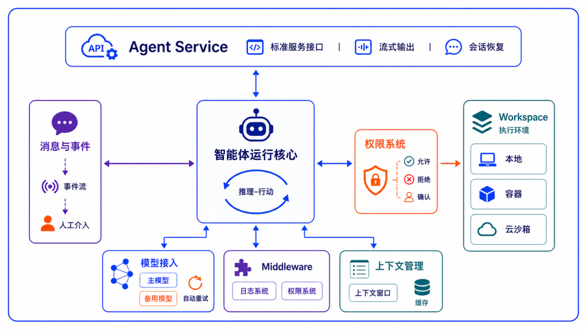
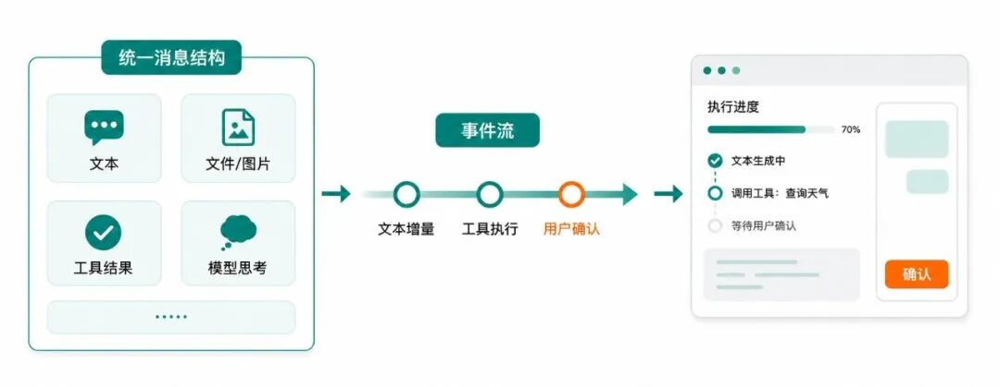

```{raw} html
<script>document.body.classList.add('agentscope-home');</script>

<div class="agentscope-landing">

<!-- ============================================================
     Hero
     ============================================================ -->
<div class="hs-hero">
  <div>
    <h1 class="hs-hero__headline">Build <span class="hs-hero__accent">distributed, enterprise-grade</span> agents.</h1>
    <p class="hs-hero__desc">AgentScope Java is the open-source agent framework for the JVM. ReAct reasoning, Harness engineering infrastructure, multi-agent orchestration, and MCP/A2A protocol support — from local prototype to enterprise-scale deployment.</p>
    <div class="hs-hero__actions">
      <a href="docs/quickstart.html" class="hs-btn hs-btn--primary">Get started →</a>
      <a href="https://github.com/agentscope-ai/agentscope-java" class="hs-btn hs-btn--secondary">
        <svg width="16" height="16" viewBox="0 0 24 24" fill="currentColor"><path d="M12 2C6.477 2 2 6.477 2 12c0 4.42 2.865 8.167 6.839 9.49.5.09.682-.217.682-.48 0-.237-.008-.866-.013-1.7-2.782.603-3.369-1.342-3.369-1.342-.454-1.155-1.11-1.462-1.11-1.462-.908-.62.069-.608.069-.608 1.003.07 1.531 1.03 1.531 1.03.892 1.529 2.341 1.088 2.91.832.092-.647.35-1.088.636-1.338-2.22-.253-4.555-1.11-4.555-4.943 0-1.091.39-1.984 1.029-2.683-.103-.253-.446-1.27.098-2.647 0 0 .84-.268 2.75 1.026A9.578 9.578 0 0112 6.836c.85.004 1.705.114 2.504.336 1.909-1.294 2.747-1.026 2.747-1.026.546 1.377.203 2.394.1 2.647.64.699 1.028 1.592 1.028 2.683 0 3.842-2.339 4.687-4.566 4.935.359.309.678.919.678 1.852 0 1.336-.012 2.415-.012 2.741 0 .267.18.577.688.48C19.138 20.163 22 16.418 22 12c0-5.523-4.477-10-10-10z"/></svg>
        GitHub
      </a>
    </div>
  </div>
  <div>
    <div class="hs-window">
      <div class="hs-window__bar">
        <div class="hs-window__dots">
          <div class="hs-window__dot hs-window__dot--r"></div>
          <div class="hs-window__dot hs-window__dot--y"></div>
          <div class="hs-window__dot hs-window__dot--g"></div>
        </div>
        <div class="hs-window__tabs">
          <div class="hs-tab active" data-panel="en-harness">HarnessAgent</div>
        </div>
      </div>
      <div class="hs-code-panel" id="en-harness"><pre><span class="kw">var</span> agent = <span class="ty">HarnessAgent</span>.builder()
    .name(<span class="str">"coder"</span>)
    .model(<span class="str">"qwen-max"</span>)                                <span class="cm">// resolved via ModelRegistry; reads DASHSCOPE_API_KEY</span>
    .workspace(<span class="ty">Paths</span>.get(<span class="str">".agentscope/workspace"</span>))   <span class="cm">// AGENTS.md · MEMORY.md · skills · subagents</span>
    .filesystem(<span class="kw">new</span> <span class="ty">DockerFilesystemSpec</span>()           <span class="cm">// sandboxed exec: local · Docker · remote KV swap in one line</span>
        .isolationScope(<span class="ty">IsolationScope</span>.USER))           <span class="cm">// shared across sessions of the same user</span>
    .build();
agent.call(msg, <span class="ty">RuntimeContext</span>.builder()
    .sessionId(<span class="str">"demo"</span>).userId(<span class="str">"alice"</span>).build()).block();</pre></div>
      <div class="hs-install">
        <code>io.agentscope:agentscope-harness:${agentscope.version}</code>
        <button class="hs-copy-btn"
                data-copy="&lt;dependency&gt;&#10;    &lt;groupId&gt;io.agentscope&lt;/groupId&gt;&#10;    &lt;artifactId&gt;agentscope-harness&lt;/artifactId&gt;&#10;    &lt;version&gt;${agentscope.version}&lt;/version&gt;&#10;&lt;/dependency&gt;">Copy Maven XML</button>
      </div>
    </div>
  </div>
</div>

<!-- Stats strip -->
<div class="hs-stats">
  <div class="hs-stat">
    <span class="hs-stat__val">Agentic</span>
    <span class="hs-stat__label">agent-first execution model</span>
  </div>
  <div class="hs-stat">
    <span class="hs-stat__val">Harness</span>
    <span class="hs-stat__label">engineering scaffolding for long runs</span>
  </div>
  <div class="hs-stat">
    <span class="hs-stat__val">Sandbox</span>
    <span class="hs-stat__label">isolated exec + snapshot resume</span>
  </div>
  <div class="hs-stat">
    <span class="hs-stat__val">Distributed</span>
    <span class="hs-stat__label">A2A / MCP / cross-process</span>
  </div>
</div>

<!-- Feature 1: Harness -->
<div class="hs-section">
  <div class="hs-split">
    <div class="hs-split__text">
      <div class="hs-chip">Harness Engineering</div>
      <h2>The engineering scaffolding for agents that stay up.</h2>
      <p>A bare ReActAgent only solves "one inference turn." <code>HarnessAgent</code> uses the two extension channels — Middleware and Toolkit — to package workspace, memory, sandbox, sub-agents, skills, and Plan Mode into a complete infrastructure for long-running agents. The reasoning loop is left intact; the harness layers on, never replaces.</p>
      <ul>
        <li><strong>Identity persists</strong> — the workspace is the agent's persona + long-term memory + domain knowledge, re-injected every turn</li>
        <li><strong>Context stays bounded</strong> — auto-compaction, large tool-result offloading, plus context-overflow retry as last-resort</li>
        <li><strong>State is recoverable</strong> — same <code>sessionId</code> across processes resumes the full conversation; sandboxes snapshot too</li>
        <li><strong>Capabilities accrue</strong> — four-layer Skill composition with curation gate; declarative sub-agent orchestration</li>
      </ul>
      <a href="docs/harness/architecture.html" class="hs-btn hs-btn--secondary" style="margin-top:4px">Learn about Harness →</a>
    </div>
    <div class="hs-split__visual">
      <div class="hs-visual">
        <div class="hs-visual__bar">
          <div class="hs-visual__bar-dots">
            <div class="hs-window__dot hs-window__dot--r"></div>
            <div class="hs-window__dot hs-window__dot--y"></div>
            <div class="hs-window__dot hs-window__dot--g"></div>
          </div>
          <span class="hs-visual__bar-title">agent runtime core · module map</span>
        </div>
        
      </div>
    </div>
  </div>
</div>

<!-- Feature 2: Events + Permissions -->
<div class="hs-section">
  <div class="hs-split hs-split--rev">
    <div class="hs-split__visual">
      <div class="hs-visual">
        <div class="hs-visual__bar">
          <div class="hs-visual__bar-dots">
            <div class="hs-window__dot hs-window__dot--r"></div>
            <div class="hs-window__dot hs-window__dot--y"></div>
            <div class="hs-window__dot hs-window__dot--g"></div>
          </div>
          <span class="hs-visual__bar-title">unified content blocks → event stream → live UI</span>
        </div>
        
      </div>
    </div>
    <div class="hs-split__text">
      <div class="hs-chip">Events · Permissions</div>
      <h2>Make execution observable and interruptible.</h2>
      <p>Messages flow as typed <code>ContentBlock</code>s — text, files, images, model thinking, tool results. A single <code>call()</code> no longer just returns the final text; it streams typed events: model calls, text deltas, tool invocations, tool results, user confirmations. Human-in-the-loop and permission approvals are first-class framework concerns.</p>
      <ul>
        <li><strong>Typed events</strong> — <code>streamEvents()</code> emits step-by-step; no manual diffing on the frontend</li>
        <li><strong>Multi-modal messages</strong> — <code>DataBlock</code> accepts both base64 and URL data sources</li>
        <li><strong>Three-state permission</strong> — static rules + tool category + input analysis → allow / approve / deny</li>
        <li><strong>External execution loop</strong> — tools can pause for an outside system to complete, then resume the task</li>
      </ul>
      <a href="docs/building-blocks/message-and-event.html" class="hs-btn hs-btn--secondary" style="margin-top:4px">Learn about events &amp; permissions →</a>
    </div>
  </div>
</div>

<!-- Feature Cards -->
<div class="hs-section">
  <div class="hs-section-hd">
    <h2>The building blocks of a dependable agent system</h2>
    <p>From model fault-tolerance to sandboxed execution, AgentScope Java 2.0 ships every engineering piece needed to keep an agent stable.</p>
  </div>
  <div class="hs-cards">
    <a class="hs-card" href="docs/building-blocks/model.html">
      <svg class="hs-card__icon" viewBox="0 0 24 24" fill="none" stroke="currentColor" stroke-width="1.5" stroke-linecap="round" stroke-linejoin="round"><path d="M16.023 9.348h4.992v-.001M2.985 19.644v-4.992m0 0h4.992m-4.993 0l3.181 3.183a8.25 8.25 0 0013.803-3.7M4.031 9.865a8.25 8.25 0 0113.803-3.7l3.181 3.182m0-4.991v4.99"/></svg>
      <h3>Model fault-tolerance</h3>
      <p>Unified Credential + ChatModel abstraction across Qwen / OpenAI / Anthropic / Gemini / DeepSeek / Ollama. Configure max retries and a fallback model — the framework auto-switches when the primary is unavailable.</p>
      <span class="hs-card__link">Learn about models →</span>
    </a>
    <a class="hs-card" href="docs/harness/memory.html">
      <svg class="hs-card__icon" viewBox="0 0 24 24" fill="none" stroke="currentColor" stroke-width="1.5" stroke-linecap="round" stroke-linejoin="round"><path d="M3.75 12h16.5M3.75 19.5h16.5M3.75 4.5h16.5M7.5 7.5a3 3 0 110-6 3 3 0 010 6zm9 0a3 3 0 110-6 3 3 0 010 6zm-9 13.5a3 3 0 110-6 3 3 0 010 6zm9 0a3 3 0 110-6 3 3 0 010 6z"/></svg>
      <h3>Context engineering</h3>
      <p>Structured compaction preserves goals / state / key findings / next steps; oversized tool results offload to disk with a placeholder in context; file IO enforces "read-before-edit" to cut redundant reads.</p>
      <span class="hs-card__link">Learn about memory →</span>
    </a>
    <a class="hs-card" href="docs/building-blocks/middleware.html">
      <svg class="hs-card__icon" viewBox="0 0 24 24" fill="none" stroke="currentColor" stroke-width="1.5" stroke-linecap="round" stroke-linejoin="round"><path d="M6 6.878V6a2.25 2.25 0 012.25-2.25h7.5A2.25 2.25 0 0118 6v.878m-12 0c.235-.083.487-.128.75-.128h10.5c.263 0 .515.045.75.128m-12 0A2.25 2.25 0 004.5 9v.878m13.5-3A2.25 2.25 0 0119.5 9v.878m0 0a2.246 2.246 0 00-.75-.128H5.25c-.263 0-.515.045-.75.128m15 0A2.25 2.25 0 0121 12v6a2.25 2.25 0 01-2.25 2.25H5.25A2.25 2.25 0 013 18v-6c0-.98.626-1.813 1.5-2.122"/></svg>
      <h3>Middleware</h3>
      <p>Four onion hooks (<code>onAgent / onReasoning / onActing / onModelCall</code>) plus the <code>onSystemPrompt</code> transformer. Plug in logging, tracing, permission checks, context injection, business policy — all without forking the core.</p>
      <span class="hs-card__link">Learn about middleware →</span>
    </a>
    <a class="hs-card" href="docs/harness/workspace.html">
      <svg class="hs-card__icon" viewBox="0 0 24 24" fill="none" stroke="currentColor" stroke-width="1.5" stroke-linecap="round" stroke-linejoin="round"><path d="M21 7.5l-9-5.25L3 7.5m18 0l-9 5.25m9-5.25v9l-9 5.25M3 7.5l9 5.25M3 7.5v9l9 5.25m0-9v9"/></svg>
      <h3>Workspace abstraction</h3>
      <p>Decouples "what the agent does" from "where it runs." WorkspaceBase unifies identity, lifecycle, resource discovery, and context offload. Switch local disk, Docker, and E2B cloud sandbox with one line; built-in warm-pool fits RL rollouts.</p>
      <span class="hs-card__link">Learn about workspace →</span>
    </a>
    <a class="hs-card" href="docs/harness/subagent.html">
      <svg class="hs-card__icon" viewBox="0 0 24 24" fill="none" stroke="currentColor" stroke-width="1.5" stroke-linecap="round" stroke-linejoin="round"><path d="M18 18.72a9.094 9.094 0 003.741-.479 3 3 0 00-4.682-2.72m.94 3.198l.001.031c0 .225-.012.447-.037.666A11.944 11.944 0 0112 21c-2.17 0-4.207-.576-5.963-1.584A6.062 6.062 0 016 18.719m12 0a5.971 5.971 0 00-.941-3.197m0 0A5.995 5.995 0 0012 12.75a5.995 5.995 0 00-5.058 2.772m0 0a3 3 0 00-4.681 2.72 8.986 8.986 0 003.74.477m.94-3.197a5.971 5.971 0 00-.94 3.197M15 6.75a3 3 0 11-6 0 3 3 0 016 0zm6 3a2.25 2.25 0 11-4.5 0 2.25 2.25 0 014.5 0zm-13.5 0a2.25 2.25 0 11-4.5 0 2.25 2.25 0 014.5 0z"/></svg>
      <h3>Multi-agent</h3>
      <p>Declare sub-agent specs in Markdown; the parent spawns them on demand with <code>agent_spawn</code> / <code>agent_send</code> in either synchronous or background mode. Background-task completion is pushed back via a <code>system-reminder</code> — no polling required.</p>
      <span class="hs-card__link">Learn about multi-agent →</span>
    </a>
    <a class="hs-card" href="docs/building-blocks/tool.html">
      <svg class="hs-card__icon" viewBox="0 0 24 24" fill="none" stroke="currentColor" stroke-width="1.5" stroke-linecap="round" stroke-linejoin="round"><path d="M11.42 15.17L17.25 21A2.652 2.652 0 0021 17.25l-5.877-5.877M11.42 15.17l2.496-3.03c.317-.384.74-.626 1.208-.766M11.42 15.17l-4.655 5.653a2.548 2.548 0 11-3.586-3.586l6.837-5.63m5.108-.233c.55-.164 1.163-.188 1.743-.14a4.5 4.5 0 004.486-6.336l-3.276 3.277a3.004 3.004 0 01-2.25-2.25l3.276-3.276a4.5 4.5 0 00-6.336 4.486c.091 1.076-.071 2.264-.904 2.95l-.102.085m-1.745 1.437L5.909 7.5H4.5L2.25 3.75l1.5-1.5L7.5 4.5v1.409l4.26 4.26m-1.745 1.437l1.745-1.437m6.615 8.206L15.75 15.75M4.867 19.125h.008v.008h-.008v-.008z"/></svg>
      <h3>Tools &amp; MCP</h3>
      <p>Annotation-driven tool registration with automatic batch / sequential / concurrent dispatch by tool attributes. Plug in any MCP-compatible server (filesystem, database, browser, code interpreter) with a central <code>workspace/tools.json</code> allowlist.</p>
      <span class="hs-card__link">Learn about tools →</span>
    </a>
  </div>
</div>

<!-- CTA -->
<div class="hs-cta">
  <h2>Ready to build?</h2>
  <p>Follow the quickstart and run a ReActAgent in minutes. When you need the long-running engineering layer, swap to <code>HarnessAgent</code> — same reasoning core, capabilities layered in as needed, business code untouched.</p>
  <a href="docs/quickstart.html" class="hs-btn hs-btn--primary">Start building →</a>
</div>

<!-- FAQ -->
<div class="hs-faq">
  <div class="hs-faq__hd">
    <h2>Frequently asked</h2>
    <p>Full Q&amp;A in the <a href="docs/others/faq.html" style="color:var(--hs-accent)">FAQ</a>, or ask on <a href="https://github.com/agentscope-ai/agentscope-java/discussions" style="color:var(--hs-accent)">GitHub Discussions</a>.</p>
  </div>
  <details class="hs-faq-item">
    <summary>Which Java version is required?</summary>
    <p><code>JDK 17</code> or later. The framework relies on Records, Sealed Classes, and other modern features, and runs on a Project Reactor non-blocking reactive execution model. For ultra-low cold-start latency, compile a GraalVM native image via Quarkus.</p>
  </details>
  <details class="hs-faq-item">
    <summary>Which LLM providers are supported?</summary>
    <p>Out of the box: OpenAI (and OpenAI-compatible endpoints including vLLM, DeepSeek, Kimi, Moonshot), Anthropic Claude, Alibaba Qwen via DashScope, Google Gemini, xAI Grok, and local Ollama. Each is a dedicated <code>ChatModel</code> implementation behind a unified builder. Retry and a fallback model can be configured at the model layer for graceful failover.</p>
  </details>
  <details class="hs-faq-item">
    <summary>How does Harness differ from a plain ReActAgent?</summary>
    <p><code>ReActAgent</code> is the "reason → tool → reply" core loop. <code>HarnessAgent</code> layers in workspace, memory, compaction, sub-agents, sandbox, Plan Mode, and skills via Middleware and Toolkit on top of the same core. Start from <code>ReActAgent</code>; when you need long-running stability, move to <code>HarnessAgent</code> without touching business logic.</p>
  </details>
  <details class="hs-faq-item">
    <summary>Is 2.0 backward-compatible with 1.0?</summary>
    <p>AgentScope Java 2.0 aims to preserve compatibility with 1.x where possible so that most users can upgrade smoothly. That said, 2.0 does introduce API-level breaking changes (typed events, the permission system, the Middleware stack, the Workspace abstraction, and more). See the <a href="docs/change-log.html">Changelog</a> for details.</p>
  </details>
  <details class="hs-faq-item">
    <summary>Does it work with Spring Boot or Quarkus?</summary>
    <p>Yes. The core modules are framework-agnostic Java libraries — drop them into Spring Boot, Quarkus, Micronaut, or any JVM application. Quarkus can also compile a GraalVM native image for sub-100 ms cold-start.</p>
  </details>
  <details class="hs-faq-item">
    <summary>How does it scale horizontally in production?</summary>
    <p>AgentScope Java is built for stateless horizontal scaling. Session state is persisted by <code>Session</code> (defaulting to <code>WorkspaceSession</code>); workspaces can be mounted on a remote KV / object store; in sandbox mode even the execution environment itself resumes across calls. Combined with Kubernetes + HPA, any replica can pick up the full context of any user.</p>
  </details>
</div>

</div><!-- .agentscope-landing -->

<script>
(function () {
  document.addEventListener('click', function (e) {
    var tab = e.target.closest('.hs-tab');
    if (!tab) return;
    var win = tab.closest('.hs-window');
    if (!win) return;
    var panelId = tab.getAttribute('data-panel');
    win.querySelectorAll('.hs-tab').forEach(function (t) { t.classList.remove('active'); });
    win.querySelectorAll('.hs-code-panel').forEach(function (p) { p.style.display = 'none'; });
    tab.classList.add('active');
    var panel = document.getElementById(panelId);
    if (panel) panel.style.display = 'block';
  });
  document.querySelectorAll('.hs-copy-btn').forEach(function (btn) {
    btn.addEventListener('click', function () {
      var text = btn.getAttribute('data-copy');
      if (!text || !navigator.clipboard) return;
      navigator.clipboard.writeText(text).then(function () {
        var orig = btn.textContent;
        btn.textContent = '✓ Copied';
        setTimeout(function () { btn.textContent = orig; }, 1800);
      });
    });
  });
})();
</script>
```
